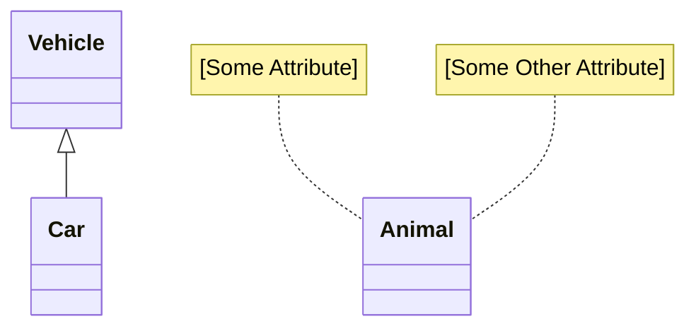
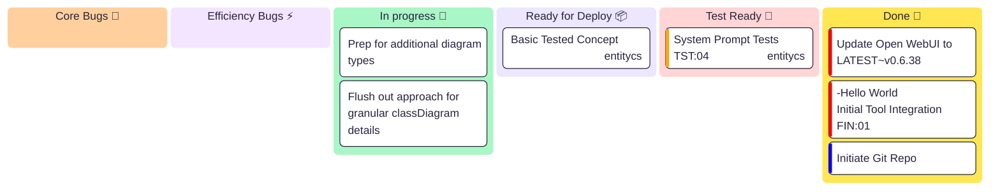

# cs2mmd 🚀

Simple Mermaid Diagram Generation from raw parsed C# code. Targeted for use in Agent Tooling (OpenAPI, MCP) environments.


```csharp
public class Vehicle{}
public class Car : Vehicle {}

[Some Attribute]
[Some Other Attribute]
public class Animal{}
```

## Getting Started 🌟

Welcome to cs2mmd! This tool helps you generate  Mermaid diagrams from your C# codebase. While some 'public' agents can manage this, you may have a smaller local or private agent, have efficiency constraints, or want to define your own logic on how non-standardized data is addressed in the diagram. Let's get you up and running!

### Configuration ⚙️

#### Target Codebase 🎯
Defined by default is an example 'Unity' project location. You can update it in the compose file.
This is where the system expects to find one or more instances of [**`VirtualFile`**](https://github.com/entitycs/cs2mmd/blob/main/src/mermaid_class/core/models.py#L4) if not defined by `content` fields.
```yaml
  mermaid-openapi:
    volumes:
      - &unity "${C_ROOT}${PROJECT_1}:/workspace/src/UnityAssets"
```
#### Compose Secrets 🔒
Keep your sensitive info safe! Use Docker Compose secrets to avoid exposing passwords in images or environment variables.

##### Postgres Password
- Update the password in `/example.secrets/postgres_pw` 📝
- Rename `/example.secrets/` to **`/secrets/`** 🔄

**Tip:** If you skip this, you might need to remove the `postgres-diagram-data` volume and rebuild the image with `docker compose build` before accessing Adminer. No worries, it's a quick fix! 🛠️

### Launch 📡
Fire it up with:
```bash
docker compose up
```
Watch the magic (ie., the combined startup logs)  in your terminal! ✨ 

#### Test / View 🧪
By default, servers run on ports 8084 and 8085.
- **OpenAPI:** http://localhost:8084 📊
- **MCP:** http://localhost:8085/mcp 🛡️

You'll see health checks in the OpenAPI container logs. All 505/OK? ✅

##### HTTP Test
- Head to http://localhost:8084/docs to explore and test endpoints interactively. (or /redoc) 🎉

##### Module Test
- Run `pytest` from inside either container to execute pre-defined tests. Verify everything works! (including the experimental [Pygres](https://github.com/entitycs/Pygres) library🔍, used to store inputs into a PostgreSQL database so that you can track what your agents are sending, and what this system will attempt to process) 🧑‍🔬.

##### Adminer
Access the database viewer at:
- http://localhost:8011 🔍

Select **PostgreSQL** as the database type. 
- Host: `postgresql` 🏠
- User and DB name are set in the compose file:
```yaml
      POSTGRES_PASSWORD_FILE: /run/secrets/postgres_pw # See 'Secrets' section above 🔒
      POSTGRES_USER: mermaid
      POSTGRES_DB: classdiagram_request
```
## Parser Information 📚

For those who want to build/fiddle...

This project utilizes [Tree-sitter](https://github.com/tree-sitter/tree-sitter-c-sharp/tree/master) as the parser for C# code. 🌳

## Current Status 📊
Here's a quick overview of our project progress in a handy Kanban board:


