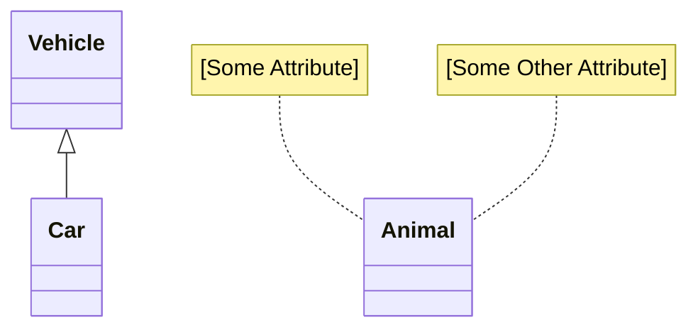
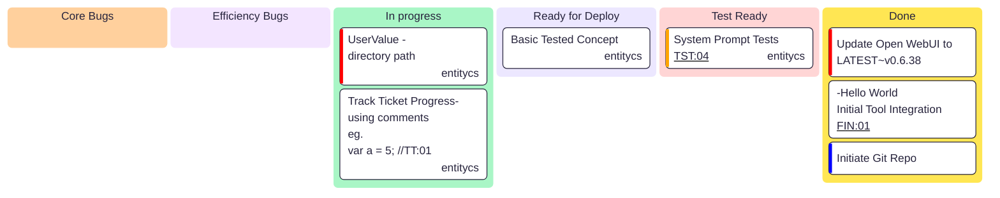

# cs2mmd
Simple Mermaid Diagram Generation from raw parsed C# code.  Targeted for use in Agent Tooling (OpenAPI, MCP) environments.


```csharp
public class Animal{}
public class Vehicle{}
public class Car : Vehicle {}
```
Current Status

